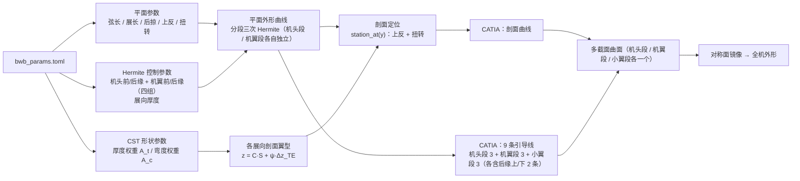

# 参数化翼身融合（BWB）飞机几何建模

[](https://www.python.org/)
[](https://numpy.org/)
[](https://github.com/evereux/pycatia)
[](#环境要求)
[](LICENSE)

用 **CST（分类函数／形状函数变换）** 描述翼型剖面、用 **三次 Hermite（施密特）曲线** 描述平面外形与展向分布，
通过 **CATIA 二次开发**自动生成翼身融合飞机的参数化三维外形，并给出便于**气动优化迭代**的参数文件接口。

---

## 目录

- [功能概览](#功能概览)
- [方法依据](#方法依据)
- [目录结构](#目录结构)
- [环境要求](#环境要求)
- [快速开始](#快速开始)
- [参数文件说明](#参数文件说明)
- [输出文件说明](#输出文件说明)
- [模块与 API](#模块与-api)
- [实现要点](#实现要点)
- [用于气动优化迭代](#用于气动优化迭代)
- [自检与验证](#自检与验证)
- [常见问题](#常见问题)
- [参考文献](#参考文献)
- [许可](#许可)

---

## 功能概览

| 能力 | 说明 |
|---|---|
| 翼型参数化 | CST 方法，伯恩斯坦多项式阶数 `cst_order`（默认 8，即 9 个形状参数 A<sub>i</sub>），分类函数 N1 = 0.5 / N2 = 1.0 |
| 平面外形参数化 | 机头段 / 机翼段 × 前缘 / 后缘共**四组独立 Hermite 参数**（互不影响），加展向厚度分布，全部由分段三次 Hermite 曲线描述，结点与切矢量可配 |
| 融合段展向厚度 | 由 Hermite 厚度曲线驱动，沿展向铺开多个剖面，厚度变化真实体现在几何中 |
| 翼梢小翼 | 过渡段 + 主段，含高度、后掠角、尖削比、安装角、倾斜角；与机翼引导线**分开创建**、分开放样 |
| 三维建模 | 自动生成剖面 → 引导线（机头/机翼/小翼各 3 条，共 9 条）→ 三段多截面曲面 → 关于机身对称面镜像 |
| 参数文件 | TOML 格式，带中文注释，支持读入 / 回写，可直接作为优化设计变量载体 |
| 无 CAD 校验 | `--no-catia` 仅做数值计算并导出 CSV，便于脱离 CATIA 检查几何 |

---

## 方法依据

外形分解为 **翼身融合段 / 机翼 / 翼梢小翼** 三部分，参数分四类：平面参数、翼型参数、
融合段展向厚度变化控制参数、翼梢小翼参数。



**CST 基本表达式**

$$z(\psi) = C(\psi)\,S(\psi) + \psi\,\Delta z_{TE},\qquad
C(\psi)=\psi^{N_1}(1-\psi)^{N_2},\qquad
S(\psi)=\sum_{i=0}^{n} A_i B_i^n(\psi)$$

其中 $B_i^n(\psi)=\binom{n}{i}\psi^i(1-\psi)^{n-i}$ 为伯恩斯坦多项式。
N1 = 0.5、N2 = 1.0 描述圆头前缘／尖形后缘；取 n 阶时共 n + 1 个形状参数，
由 n + 1 个型值点解线性方程组即可确定。

**三次 Hermite 基本表达式**

$$P(t)=h_{00}(t)P_0+h_{10}(t)R_0+h_{01}(t)P_1+h_{11}(t)R_1,\qquad t\in[0,1]$$

其中 $P_0,P_1$ 为端点、$R_0,R_1$ 为端点切矢量。分段使用时连接处共享切矢量，
因此天然一阶连续（C1），改变切矢量大小即可控制曲线松紧。

---

## 目录结构

```
参数化翼身融合/
├── main.py               # 主程序：参数定义、剖面/外形生成、CATIA 建模流程
├── cst_curve.py          # CST 分类函数/形状函数/翼型（可独立运行自检）
├── hermite_curve.py      # 三次 Hermite 曲线与分段 C1 曲线（可独立运行自检）
├── params_file.py        # 参数文件读写（TOML，可独立运行自检）
├── bwb_params.toml       # ★ 参数文件：所有设计变量都在这里
├── requirements.txt      # 依赖
├── LICENSE               # MIT
├── .gitignore
├── output/               # 运行后生成的 CSV（已忽略，不入库）
└── 参考文献/              # 依据的两篇论文（第三方版权，默认不入库）
```

---

## 环境要求

| 项 | 要求 |
|---|---|
| 操作系统 | Windows |
| Python | 3.11 及以上（`tomllib` 为标准库） |
| 依赖 | `numpy`；三维建模另需 `pycatia` + 本机安装 **CATIA V5** |
| 开发环境验证 | Python 3.14.3 / numpy 2.5.3 / pycatia 0.10.1 |

```bash
pip install -r requirements.txt
```

> 只想做数值计算、不连 CATIA 时，可以不装 `pycatia`，直接使用 `--no-catia`。

---

## 快速开始

```bash
# 1) 不连 CATIA，只算几何并导出 CSV（缺失参数文件时自动生成）
python main.py --no-catia

# 2) 连接 CATIA 生成三维模型
python main.py

# 3) 使用论文表 1 中的模型 B 参数（或用参数文件里的 model = "B"）
python main.py --model B

# 4) 指定参数文件 / 指定 CSV 输出目录
python main.py --params my_design.toml --csv-dir out

# 5) 导出当前生效的完整参数（含 CST 权重与 Hermite 控制点），供优化迭代使用
python main.py --export-params iter_000.toml --no-catia
```

完整命令行参数：

```
-h, --help            显示帮助
--params PARAMS       参数文件路径（TOML，默认 ./bwb_params.toml，缺失时自动生成）
--model {A,B,a,b}     覆盖参数文件中的 model 预设
--no-catia            仅做数值计算并导出 CSV，不连接 CATIA
--csv-dir CSV_DIR     CSV 导出目录（默认 ./output）
--export-params PATH  把当前生效的完整参数写出为 TOML
```

运行 `python main.py` 时控制台会打印四个阶段的进度：

```
参数文件：...\bwb_params.toml
===== 剖面表（展向站位 / 弦长 / 前缘 x / t/c）=====
----- 曲线控制参数（气动优化的设计变量）-----
[1/4] 已创建 11 个控制剖面（CST 上下表面样条）
[2/4] 已创建引导线（9 条）：nose_le, nose_te_lo, nose_te_up, wing_le, ...
[3/4] 机头段多截面曲面：剖面 3 个（y=0~1150），引导线 3 条
[3/4] 机翼段多截面曲面：剖面 7 个（y=1150~4000），引导线 3 条
      翼梢小翼多截面曲面：剖面 3 个，引导线 3 条
[4/4] 已关于机身对称面镜像 3 个曲面
CATIA 模型生成完成。
```

---

## 参数文件说明

参数文件为 **TOML** 格式（支持注释、分组清晰、Python 标准库直接读取）。
所有长度单位为 **mm**，角度单位为 **度**。写错键名会在运行时提示并忽略，不会中断。

### `[general]` 通用

| 键 | 默认 | 说明 |
|---|---|---|
| `model` | `"A"` | 预设型号 `A` / `B`（仅填充文件中**未列出**的键） |
| `name` | `"ModelA"` | 模型名，用于输出 CSV 与 CATIA 特征命名 |

### `[planform]` 平面参数

| 键 | 默认 | 说明 |
|---|---|---|
| `root_chord` / `mid_chord` / `tip_chord` | 4500 / 2500 / 500 | 根部／交界（机头段与机翼段）／翼尖弦长 |
| `inner_span` / `semi_span` | 1150 / 4000 | 内段展长（半模）／半展长 |
| `nose_span` | 0 | 机头段结束的展向位置；**0 = 取 `inner_span`**，即以内／外翼交界为分界 |
| `inner_sweep` / `outer_sweep` | 60 / 35 | 机头段／机翼段前缘后掠角 |
| `dihedral` | 0 | 上反角 |
| `incidence_root` / `incidence_tip` | 0 / −2 | 根部／翼尖安装角（正值为抬头） |

### `[airfoil]` 翼型参数

| 键 | 默认 | 说明 |
|---|---|---|
| `root_thickness` / `mid_thickness` / `tip_thickness` | 0.20 / 0.14 / 0.10 | 各站位相对厚度 t/c |
| `camber_ratio` | 0.02 | **实际最大弯度**（已含反弯影响） |
| `camber_pos` | 0.40 | 最大弯度弦向位置 |
| `reflex` | 1.0 | 反弯系数 0~1；1 = 后缘弯度斜率归零 |
| `cst_order` | 8 | 伯恩斯坦多项式阶数（形状参数个数 = 阶数 + 1） |
| `cst_n1` / `cst_n2` | 0.5 / 1.0 | 分类函数 N1 / N2 |
| `te_thickness` | 0.0025 | 后缘相对厚度，**不随厚度缩放**（各剖面一致） |

### `[cst_shape]` CST 形状函数参数（气动优化设计变量）

| 键 | 说明 |
|---|---|
| `mode` | `"naca"` 由 `[airfoil]` 生成基准翼型；`"weights"` 直接采用下面的 A<sub>i</sub> |
| `shape_mode` | `"same"` 各剖面共用权重；`"per_station"` 使用 `[cst_shape.sections]` 逐剖面覆盖 |
| `thickness_weights` | 厚度形状参数 A<sub>t</sub>，决定厚度分布，按各剖面 t/c 缩放 |
| `camber_weights` | 弯度形状参数 A<sub>c</sub>，决定弯度线形状，按 `camber_ratio` 缩放 |

上下表面权重由两者**精确线性组合**（CST 对形状参数是线性的）：

$$A_{upper}=A_c+A_t,\qquad A_{lower}=A_c-A_t$$

这样做的好处：展向缩放厚度只需缩放 A<sub>t</sub>，弯度完全不受影响。

### `[hermite.*]` 平面外形：机头段 / 机翼段 × 前缘 / 后缘 = **四组独立参数**

四组参数互不影响，各自描述一段平面外形曲线（分段三次 Hermite）。
分界位置 `y_j = junction_span = nose_span > 0 ? nose_span : inner_span`：

| 分组 | 展向区间 | 曲线（2D 平面外形） |
|---|---|---|
| `[hermite.nose_leading_edge]` | `0 ~ y_j` | 机头段前缘 `x_LE(y)` |
| `[hermite.nose_trailing_edge]` | `0 ~ y_j` | 机头段后缘 `x_TE(y)` |
| `[hermite.wing_leading_edge]` | `y_j ~ semi_span` | 机翼段前缘 `x_LE(y)` |
| `[hermite.wing_trailing_edge]` | `y_j ~ semi_span` | 机翼段后缘 `x_TE(y)` |

| 键 | 说明 |
|---|---|
| `points` | 结点 `[[展向 y, x], ...]`，x 为该处前缘／后缘的弦向坐标 |
| `slopes` | 各结点 `dx/dy`（= tan 后掠角），个数需与结点数一致；留空则该段用 Catmull-Rom 自动估计 |

行为约定：

* **留空**时该段按 `[planform]` 的后掠角与弦长分布生成**直线段**（与常规参数完全一致）；
* 只给**部分结点**时，缺失的端点用后掠角／弦长算得的默认值补上，保证曲线覆盖整段；
* 结点**超出该段展向区间**时给出提示并忽略；
* 斜率个数与结点个数不一致时，该段整段退回自动切矢量；
* 弦长统一由 `chord(y) = x_TE(y) − x_LE(y)` 得到（后缘未给 Hermite 的一段退化为线性弦长分布）；
* 两段在交界处 x 不一致时，`print_controls` 会给出"交界不连续"提示（可据此调整结点）。

> 机头段与机翼段在 CATIA 中各自**独立创建引导线并独立放样**（见下），
> 交界处的剖面被两个曲面共用，因此两段曲面天然衔接。

### `[hermite.span_thickness]` 融合段展向厚度

| 键 | 说明 |
|---|---|
| `points` | 结点 `[[展向 y, 相对厚度 t/c], ...]`，可给任意多个（默认取根部／中部／翼尖三点） |
| `slopes` | 各结点 `d(t/c)/dy`，留空用自动估计 |

### `[discretization]` 离散化

| 键 | 默认 | 说明 |
|---|---|---|
| `n_section_pts` | 81 | 每个剖面的总点数（上下表面闭合一圈） |
| `n_le_pts` | 61 | 引导线按 Hermite 采样的点数 |
| `n_sections_span` | 9 | 展向厚度曲线采样点数（打印用） |
| `n_span_stations` | 9 | **展向剖面数**（余弦分布）；越大越能体现融合段展向厚度变化 |

> 上表为**程序内置默认值**。仓库中的 `bwb_params.toml` 取更密的离散（`n_section_pts = 200`、
> `n_le_pts = 100`）；参数文件里写了的键以文件为准。

---

## 输出文件说明

`--no-catia` 或 `--export-params` 会在 `--csv-dir` 下生成：

| 文件 | 内容 |
|---|---|
| `{名称}_section_{站位}.csv` | 每个剖面的闭合翼型点列 `x_mm, y_mm, z_mm` |
| `{名称}_leading_edge.csv` | 前缘平面外形（全展长 3D 点列，含机头段 + 机翼段） |
| `{名称}_trailing_edge.csv` | 后缘平面外形（全展长 3D 点列） |

默认 9 个展向剖面 + 2 个小翼剖面 + 2 条曲线 = **13 个 CSV**。

在 CATIA 中生成的几何（均位于混合实体 `BWB_{名称}` 下）：

| 特征 | 数量 | 说明 |
|---|---|---|
| `section_*` | 11 | 闭合剖面曲线（上/下表面样条 + 后缘直线 + 接合） |
| `nose_leading_edge` | 1 | **机头段**前缘引导线（y = 0 ~ 交界） |
| `nose_trailing_edge_upper` / `_lower` | 2 | **机头段**后缘上／下引导线 |
| `wing_leading_edge` | 1 | **机翼段**前缘引导线（交界 ~ 翼尖） |
| `wing_trailing_edge_upper` / `_lower` | 2 | **机翼段**后缘上／下引导线 |
| `winglet_leading_edge` | 1 | 小翼前缘引导线 |
| `winglet_trailing_edge_upper` / `_lower` | 2 | 小翼后缘上／下引导线 |
| `BWB_nose_*` / `BWB_wing_*` / `BWB_winglet_*` | 3 | 机头段／机翼段／小翼段多截面曲面（机头段与机翼段共用交界剖面） |
| `BWB_mirror1_*` … `BWB_mirror3_*` | 3 | 关于机身对称面（x–z 平面）镜像 |

---

## 模块与 API

### `cst_curve.py` — CST 曲线与翼型

| 函数 / 类 | 说明 |
|---|---|
| `class_function(psi, n1, n2)` | 分类函数 $C(\psi)$ |
| `bernstein_basis(psi, order)` | 伯恩斯坦基矩阵 |
| `cst_ordinates(psi, weights, n1, n2, te)` | 由形状参数求曲线高度 $z(\psi)$ |
| `fit_cst(psi, zeta, order, n1, n2, te, scaled=True)` | 由型值点反求形状参数（默认对 S 拟合，良态无振荡） |
| `class CSTAirfoil` | 翼型对象：`upper/lower` 权重、独立的上下后缘项、`upper_ordinates()` / `coordinates()` / `max_thickness_ratio` 等 |
| `cst_weights_from_naca(...)` | 把 NACA 基准翼型写成厚度／弯度形状参数 |
| `make_cst_section(...)` | 由设计参数直接生成翼型 |
| `make_cst_section_from_weights(...)` | 由厚度／弯度权重 + 目标 t/c、弯度生成翼型 |
| `smoothness_report(zeta, label)` | 光滑性检查：统计二阶差分符号变化（≥ 4 次即为振荡） |

### `hermite_curve.py` — 三次 Hermite 曲线

| 函数 / 类 | 说明 |
|---|---|
| `hermite_basis(t)` / `hermite_basis_derivative(t)` | 混合函数及其导数 |
| `hermite_point(p0, p1, r0, r1, t)` | 单点求值（支持 2D / 3D） |
| `hermite_curve(p0, p1, r0, r1, num)` | 等参数采样 |
| `class HermiteSegment` | 单段曲线：`evaluate` / `derivative` / `sample` / `length` |
| `class PiecewiseHermite` | 分段 C1 曲线链：`from_points` / `from_slopes` / `sample` / `tangent_at` / `length` |
| `tangents_from_points(points, method)` | 自动切矢量：Catmull-Rom / cardinal / natural |
| `spanwise_thickness_curve(...)` | 融合段展向厚度变化曲线 |

### `params_file.py` — 参数文件读写

| 函数 | 说明 |
|---|---|
| `load_param_dict(path)` | 读取 TOML，返回与文件结构一致的嵌套字典 |
| `flatten_param_dict(raw)` | 拆成 `(扁平标量字典, 结构化分组)` |
| `save_param_file(data, path)` | 回写 TOML（支持多层子表与数组） |
| `ensure_param_file(path)` | 文件不存在时按默认模板生成 |

### `main.py` — 建模流程

| 函数 | 说明 |
|---|---|
| `class BWBParameters` | 全部参数 + `from_dict` / `to_dict` / `to_param_dict` / `to_model_b` |
| `hermite_from_slopes(nodes, slopes)` | 由结点与斜率构建分段 Hermite（切矢量取 $(\Delta x,\ \Delta x \cdot slope)$，斜率物理含义严格为 dy/dx） |
| `segment_curve` / `leading_edge_x` / `trailing_edge_x` | 取某一段（机头/机翼 × 前缘/后缘）的 Hermite 曲线 / 前缘 x / 后缘 x |
| `junction_span` / `check_segment_joint` | 机头段与机翼段的分界展向位置 / 交界连续性自检 |
| `station_at` | **引导线与剖面共用的**剖面几何（含上反与扭转） |
| `chord_at_span` / `thickness_at_span` | 弦长 / 展向厚度分布 |
| `span_station_positions` | 展向站位（余弦分布，关键站位保留名字） |
| `build_stations` / `section_surface_curves` | 剖面集合 / 剖面上下面曲线 |
| `guide_points` / `add_guides` | 9 条引导线点列（机头段 3 / 机翼段 3 / 小翼段 3，后缘各上、下两条） / CATIA 引导线 |
| `build_catia_model` | 剖面 → 引导线 → 多截面曲面 → 镜像 |

---

## 实现要点

工程上踩过并已解决的问题，记录在此便于后续维护：

1. **CST 后缘必须自洽**。分类函数在 $\psi \to 1$ 时趋于 0，形状函数**无法**在后缘达到任意目标值。
   若拟合目标的后缘值与 $\psi \cdot \Delta z_{TE}$ 项不一致，最小二乘只能用大幅正负交替的权重去凑，
   曲线就会抖动。因此弯度线保证 $z_c(1)=0$、半厚度保证在 $\psi=1$ 处等于 $te/2$，
   并且 **`fit_cst` 默认对形状函数 S 拟合**（先除以分类函数），而不是拟合 $C \cdot S$。

2. **圆头前缘的切线是垂直弦向的**。上下表面各做一条样条、共享同一个前缘点，
   并各自沿 $-\mathbf{e}_{thick}$ 施加切矢约束；用一条样条绕过前缘会形成尖点并引起抖动。

3. **剖面局部坐标系**取 $\mathbf{e}_{thick}=\mathbf{e}_{chord}\times\mathbf{e}_{span}$，
   展向轴含上反角／小翼倾斜角，剖面才不会被压扁或扭曲。

4. **引导线与剖面必须用同一个几何来源**（`station_at`）。否则带扭转时剖面后缘点会偏离
   "前缘 + 弦长"的平面外形曲线（翼尖 −2° 即差约 17 mm），导致剖面与引导线不相交、放样失败。

5. **后缘需要上、下两条引导线**。闭合剖面的后缘是"上表面点 + 下表面点"两个角点，
   只给一条中弧线引导线无法正常放样。两条曲线由**同一组** Hermite 参数（中弧线）沿
   $\mathbf{e}_{thick}$ 偏移 $\pm \frac{te}{2}c$ 得到，因此参数仍然只有一组。

6. **机头段 / 机翼段 / 翼梢小翼段的曲线与放样全部分开**，避免相互影响；
   相邻两段共用交界处的剖面，因此曲面之间自然衔接。机头段与机翼段的分界位置由
   `nose_span` 给出（默认取 `inner_span`），四组 Hermite 参数各管一段，互不干扰。
   交界处若两段 x 不连续，`print_controls` 会给出提示。

7. **展向厚度要铺开站位才有效**。只有 3 个剖面时放样只是在它们之间插值，
   Hermite 厚度曲线形同虚设；改为余弦分布的 `n_span_stations` 个剖面后才真实体现。

---

## 用于气动优化迭代

所有曲线控制参数都可以程序化读写，适合作为设计变量放进优化循环：

```python
import copy
from main import BWBParameters
from params_file import load_param_dict, flatten_param_dict, save_param_file

# 1) 读入参数
raw = load_param_dict("bwb_params.toml")
params = BWBParameters.from_dict(*flatten_param_dict(raw))

# 2) 修改设计变量
params.cst_thickness_weights[4] *= 1.2          # 调整厚度形状参数 A_4
params.hermite_nose_le_points = [[0.0, 0.0], [1050.0, 2400.0], [2100.0, 3637.3]]
params.hermite_nose_le_slopes = [0.80, 1.40, 1.7321]      # 机头段前缘
params.hermite_wing_le_points = [[2100.0, 3637.3], [8000.0, 8000.0], [13000.0, 11275.7]]
params.hermite_wing_le_slopes = [1.00, 0.62, 0.7002]      # 机翼段前缘
params.hermite_wing_te_points = [[2100.0, 7237.3], [13000.0, 12275.7]]
params.hermite_wing_te_slopes = [-0.149, -0.149]          # 机翼段后缘
params.n_span_stations = 13                     # 加密展向剖面

# 3) 回写成新的参数文件（供 main.py 或外部求解器使用）
save_param_file(params.to_param_dict(), "iter_001.toml")

# 4) 也可以直接在内存里取几何点做分析
from main import build_stations, section_coordinates
for st in build_stations(params):
    pts = section_coordinates(st, num=params.n_section_pts)
```

命令行方式：

```bash
python main.py --export-params iter_001.toml --no-catia   # 导出当前完整参数
python main.py --params iter_001.toml                     # 用新参数重建
```

**设计变量建议**

| 类别 | 变量 | 数量（默认） |
|---|---|---|
| 翼型厚度分布 | `thickness_weights` | 9 |
| 翼型弯度线 | `camber_weights` | 9 |
| 展向厚度分布 | `hermite.span_thickness` 的 `points` / `slopes` | 可配 |
| 平面外形（四组） | `hermite.nose_leading_edge` / `nose_trailing_edge` / `wing_leading_edge` / `wing_trailing_edge` 的 `points` / `slopes` | 可配 |
| 机头段展向范围 | `nose_span`（分界位置） | 1 |
| 相对厚度分布 | `root_thickness` / `mid_thickness` / `tip_thickness` | 3 |
| 小翼 | `winglet_height` / `_taper` / `_sweep` / `_cant` / `_incidence` | 5 |

---

## 自检与验证

三个模块都可以独立运行自检：

```bash
python cst_curve.py        # CST：拟合精度、后缘自洽性、光滑性（振荡）、厚度/弯度权重
python hermite_curve.py    # Hermite：端点切矢量、C1 连续性、弧长、展向厚度
python params_file.py      # 参数文件：解析分组、回写后重新读取一致性
```

当前自检结果：

| 指标 | 结果 |
|---|---|
| CST 拟合 NACA 2412 最大误差 | 6.1e-05 |
| CST 厚度分布与解析 NACA 最大偏差 | 2.7e-04 |
| 后缘自洽量（目标 vs 模型） | −2.8e-17（机器精度） |
| 翼型曲线二阶差分符号变化（振荡指标） | 0 次（≥ 4 视为抖动） |
| 剖面实际 t/c 与设定值 | 0.20000 / 0.14000 / 0.10000（精确命中） |
| 后缘厚度 | 各剖面恒为 0.00250（不随厚度缩放） |
| 权重模式分解恒等式 `upper = camber + thickness` | 4.2e-17 |
| Hermite 分段连接处 C1 连续性 | True |
| 剖面角点与引导线距离（机头段 + 机翼段 9 个 + 小翼 2 个剖面） | 0.000e+00 mm |
| 后缘上/下引导线均值 vs 单一参数中弧线 | 3.6e-15 mm |
| 机头段 / 机翼段前缘结点插值复现（四组参数各自独立） | 精确命中（< 1e-6 mm） |
| 机头段与机翼段交界不连续性检查 | 可检出并提示 |
| 参数文件回写后重新读取一致 | True |

---

## 常见问题

**Q：一定要装 CATIA 吗？**
不用。加 `--no-catia` 可只做数值计算与 CSV 导出，便于在没有 CATIA 的机器上检查几何。

**Q：单位是什么？**
长度 mm、角度度。CATIA 自动化接口的长度单位就是 mm，无需换算。

**Q：`camber_ratio` 为什么和看到的弯度不一样？**
`camber_ratio` 的含义是**实际最大弯度**（已含反弯影响）。`reflex = 1` 会把弯度线压成 S 形、
最大弯度明显减小，本程序按最大弯度归一化，所以填 0.02 就得到 2% 实际弯度。
若想复现普通 NACA 弯度线（不减弱弯度），把 `reflex` 设为 0。

**Q：设了 Hermite 控制点却没生效？**
检查结点是否落在**该段自己的展向区间**内（机头段 `0 ~ nose_span`，机翼段 `nose_span ~ semi_span`）：
超出区间的结点会打印提示并被忽略。每段曲线只覆盖自己的区间，缺失的端点会自动用
后掠角／弦长算得的值补上，不会外推到另一段。
`slopes` 个数需与 `points` 一致；个数不匹配时**该段**会退化为 Catmull-Rom 自动切矢量
（不影响另一段）。运行时会打印 `曲线控制参数` 一览，逐段列出结点、切矢量与数据来源，
可据此确认哪些参数来自文件、哪些是自动生成。

**Q：机头段和机翼段在交界处"错开"了？**
两段参数完全独立，若你在交界处给了两个不同的 x，曲线就会出现台阶。
`print_controls` 会打印 `交界 y=… 处前缘/后缘 x 不连续` 提示；把两段在 `y = nose_span`
处的结点写成同一个值即可（默认留空时不会出现该问题）。

**Q：`output/` 里的文件要提交吗？**
不需要，`.gitignore` 已忽略。它们是可再生的中间产物。

---

## 参考文献

本项目的方法依据：

1. 戴浩, 余雄庆. **翼身融合飞机参数化几何模型**[J]. 飞机设计, 2012, 32(2): 11-14.
   —— CST 方法、三次 Hermite 曲线、三维矩阵变换、CATIA 二次开发流程
2. 邓海强, 余雄庆, 尹海莲, 邓枫. **翼身融合无人机参数化建模与气动特性分析**[J].
   航空计算技术, 2016, 46(6): 51-55. —— 考虑操纵面偏转的建模与气动分析流程
3. Kulfan B. **Universal parametric geometry representation method**[J].
   Journal of Aircraft, 2008, 45(1): 142-158. —— CST 方法原始文献

> `参考文献/` 目录下的论文 PDF 属**第三方版权资料**，`.gitignore` 默认将其排除。
> 若本仓库为私有且确需归档，删除 `.gitignore` 中 `参考文献/` 一行即可；
> 公开仓库建议只保留上面的题录引用。

---

## 许可

本项目采用 [MIT 许可证](LICENSE)，版权归 © 2026 supersdd114514 所有。

`参考文献/` 目录中的论文为第三方出版物，版权归原作者与出版方所有，仅作学习参考，
**不在本许可证覆盖范围内**。
